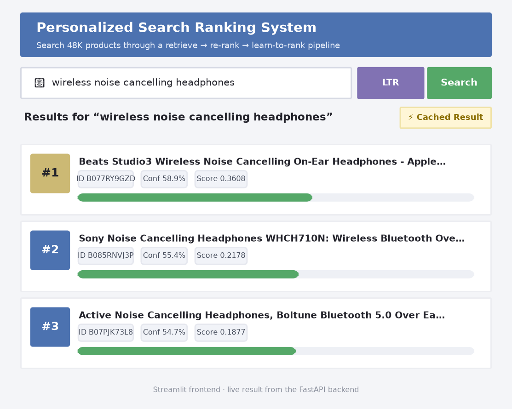
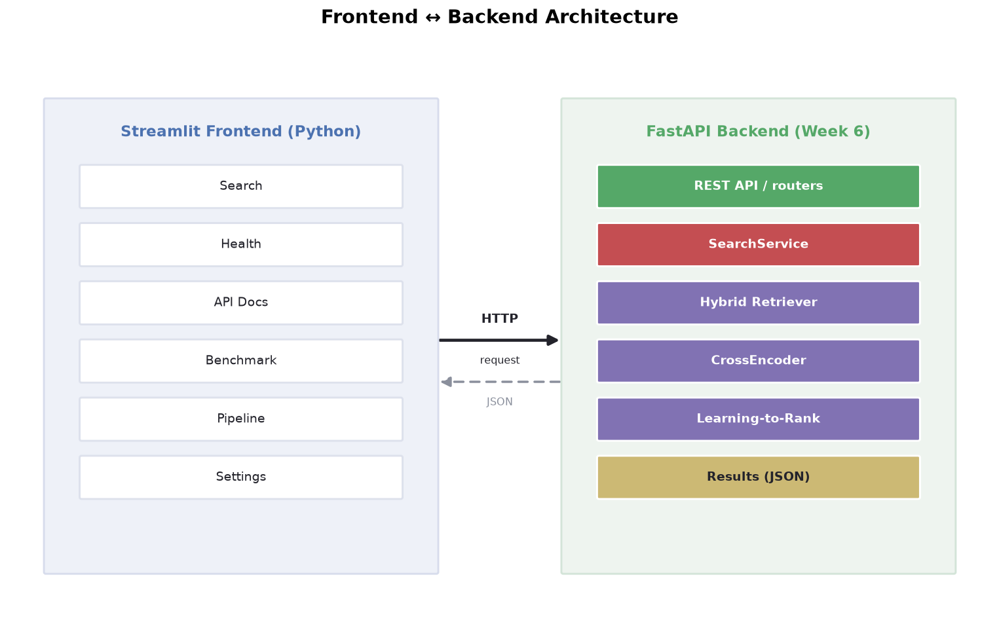
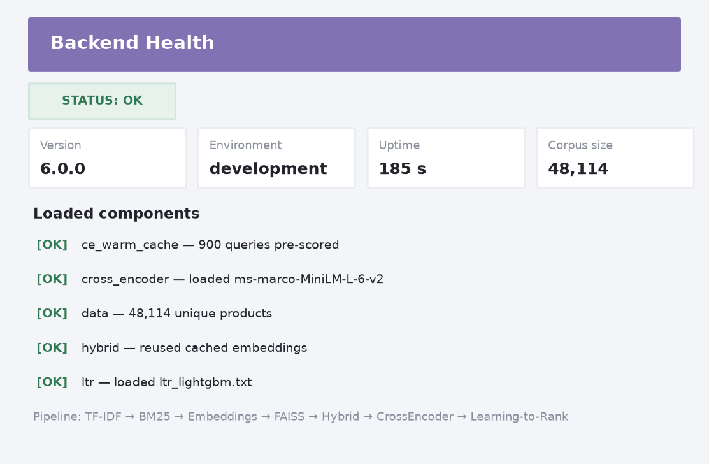
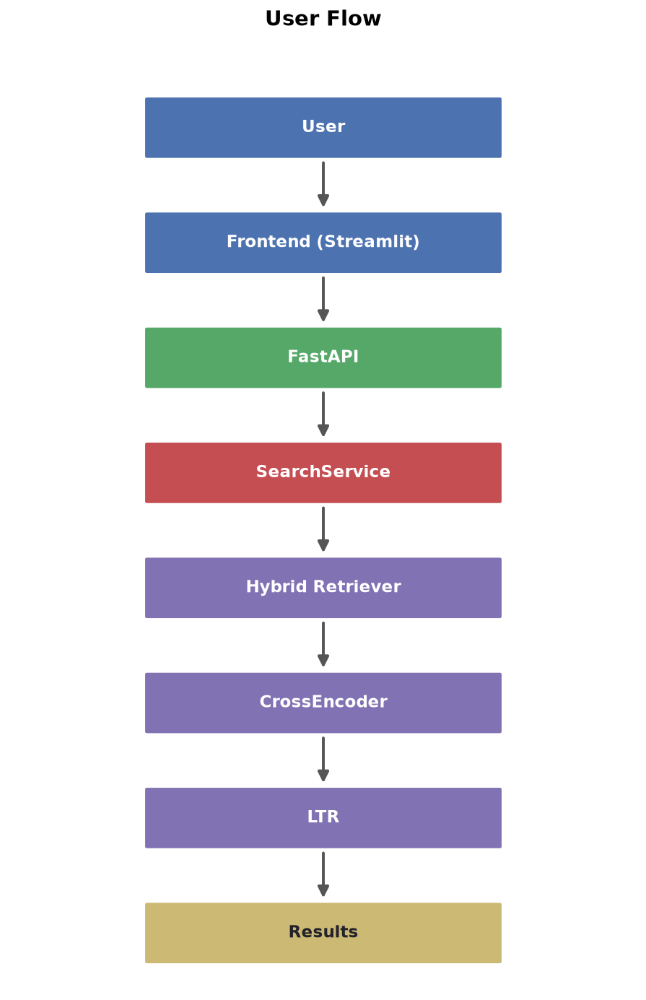

# Personalized Search Ranking System

<p align="center">
  <a href="https://www.python.org/"></a>
  <a href="https://fastapi.tiangolo.com/"></a>
  <a href="https://streamlit.io/"></a>
  <a href="https://lightgbm.readthedocs.io/"></a>
  
  <a href="LICENSE"></a>
  <a href="https://aws.amazon.com/"></a>
</p>

A production-grade search and ranking system built on real e-commerce search
data. It takes a shopper's query and ranks candidate products by relevance
through a multi-stage **retrieve → re-rank → learn-to-rank** pipeline, then
serves the trained model as a **FastAPI REST API** with a **Streamlit** web app.



**Highlights**

- **48,114-product** search corpus with graded human relevance labels.
- **Six retrieval/ranking approaches** compared on identical queries and metrics.
- Best **NDCG@10 of 0.5044** — a **+31.6%** lift over the BM25 baseline.
- **Seven FastAPI endpoints** with auto-generated Swagger docs.
- **Six-page Streamlit** search interface.
- **69 passing automated tests** across backend and frontend.
- **CPU-only inference** — no GPU required.
- **MIT-licensed** and **AWS-ready** architecture.

<p align="center">
  
</p>

## Table of Contents

- [Overview](#overview)
- [Features](#features)
- [Tech Stack](#tech-stack)
- [Pipeline](#pipeline)
- [Repository Structure](#repository-structure)
- [Results](#results)
- [Screenshots](#screenshots)
- [API](#api)
- [Installation](#installation)
- [Running Locally](#running-locally)
- [Configuration](#configuration)
- [AWS Deployment](#aws-deployment)
- [License](#license)

## Overview

Product search returns the most relevant items from a large catalog in response
to a free-text query such as `wireless headphones` or `blue yoga mat`. The core
challenge is **ranking**: given many candidate products, decide the order they
appear in so the items a shopper most likely wants surface at the top. Small
ranking gains translate into large gains in discovery, conversion, and trust.

The system is grounded in the **Amazon ESCI Shopping Queries Dataset**, a public
benchmark of real shopping queries paired with products and graded human
relevance judgments (Exact / Substitute / Complement / Irrelevant, mapped to
3 / 2 / 1 / 0). This enables NDCG-based evaluation and a fair comparison of every
retrieval method on the same queries, corpus, and metrics.

The final architecture is a multi-stage funnel: fast lexical + semantic retrieval
narrows ~48K products to a small candidate set, a **cross-encoder** re-scores that
set by reading each query and product jointly, and a **Learning-to-Rank** model
learns to combine every signal into the final ordering. The trained pipeline is
served over HTTP by a FastAPI backend and consumed by a Streamlit search app.

## Features

- **TF-IDF and BM25** lexical retrieval baselines.
- **Sentence-Transformer embeddings** (`all-MiniLM-L6-v2`) with **FAISS** search.
- **Hybrid** lexical–semantic score fusion.
- **Cross-encoder** Top-50 re-ranking.
- **LightGBM LambdaMART** Learning-to-Rank stage.
- **FastAPI REST API** with auto-generated **Swagger** docs.
- **Streamlit** search interface.
- **Query caching** for near-instant repeat queries.
- **Health and version** endpoints.
- **Typed Pydantic** request/response contracts.
- **Structured request logging** with correlation IDs.
- **Environment-based configuration** — no hardcoded paths.
- **Automated backend and frontend tests**.
- **CPU-only deployment**.

## Tech Stack

| Layer | Technologies |
| --- | --- |
| Language | Python |
| Lexical retrieval | scikit-learn (TF-IDF), rank-bm25 |
| Semantic retrieval | Sentence-Transformers (`all-MiniLM-L6-v2`), FAISS |
| Re-ranking | Cross-encoder (`ms-marco-MiniLM-L-6-v2`) |
| Learning-to-Rank | LightGBM (LambdaMART) |
| API | FastAPI, Pydantic, Uvicorn |
| Frontend | Streamlit |
| Testing | pytest |

## Pipeline

```
Dataset
   ↓
TF-IDF
   ↓
BM25
   ↓
Embeddings
   ↓
FAISS
   ↓
Hybrid
   ↓
CrossEncoder
   ↓
Learning-to-Rank
   ↓
FastAPI
   ↓
REST API
   ↓
Streamlit
```

At the final stage, **LambdaMART learns how to combine lexical, semantic, hybrid,
and cross-encoder signals into the final product ordering using graded relevance
labels.**

## Repository Structure

```
.
├── src/            # Retrieval, re-ranking, and LTR models + evaluation scripts
├── api/            # Production FastAPI backend (routers, services, schemas, tests)
├── frontend/       # Streamlit search app (pure HTTP client of the backend)
├── evaluation/     # Ranking metrics (Precision@K, Recall@K, NDCG@K)
├── models/         # Local cross-encoder + trained LambdaMART model
├── results/        # Metrics, benchmarks, and generated diagrams
├── data/           # Dataset download/setup instructions; raw data kept local
├── requirements.txt
├── LICENSE
└── README.md
```

## Results

**Final ranking quality improved from NDCG@10 `0.3831` with BM25 to `0.5044` with
Hybrid + Cross-Encoder + LTR.**

All six methods are scored on the **same 225 held-out test queries** the LTR
model never trained on (split by query, fixed seed), against the 48,114-product
corpus at a cutoff of 10.

| Method | Precision@10 | Recall@10 | NDCG@10 | MAP | MRR |
| --- | --- | --- | --- | --- | --- |
| TF-IDF | 0.0387 | 0.2941 | 0.1679 | 0.1211 | 0.1442 |
| BM25 | 0.0707 | 0.5130 | 0.3831 | 0.3272 | 0.3826 |
| Embeddings | 0.0684 | 0.5150 | 0.3507 | 0.2853 | 0.3149 |
| Hybrid | 0.0804 | 0.5896 | 0.4348 | 0.3710 | 0.4220 |
| Hybrid + Cross-Encoder | 0.0893 | 0.6440 | 0.5006 | 0.4410 | 0.4825 |
| **Hybrid + Cross-Encoder + LTR** | **0.0893** | **0.6444** | **0.5044** | **0.4455** | **0.4872** |

The full pipeline ending in **Learning-to-Rank is the best method** on every
ranking-quality metric (NDCG@10, MAP, MRR). It improves NDCG@10 by **+16.0%** over
the hybrid retriever and **+31.6%** over BM25.

> **Note on Precision@10.** Precision stays low for every method because the labels
> are sparse: most queries have only 1–2 judged-relevant products, so a single
> relevant item already caps Precision@10 at 0.10. Recall@10 and NDCG@10 are the
> informative metrics in this setup.

## Screenshots

**Search page** — result cards with rank, title, product ID, confidence bar, raw
score, latency, ranking method, expandable details, and a ⚡ Cached Result badge:


**Health page** — live backend status, version, pipeline stages, corpus size,
loaded components, and cache status:



**User flow:**



## API

The backend uses a layered design where the web layer knows nothing about ML and
the ML layer knows nothing about HTTP — they meet only through typed Pydantic
models. A single `SearchService` loads every model, cached embedding, FAISS index,
and the trained LTR model once and reuses them.

| Method & Path | Purpose |
| --- | --- |
| `POST /search` | Generic search; pick `method`: `tfidf`, `bm25`, `embedding`, `hybrid`, `rerank`, or `ltr`. |
| `POST /hybrid-search` | Hybrid BM25 + embedding fusion (optional `alpha`/`beta`). |
| `POST /rerank` | Hybrid retrieval → cross-encoder re-ranking. |
| `POST /ltr-search` | Full pipeline → Learning-to-Rank (best quality, recommended). |
| `GET /health` | Liveness/readiness probe (503 + missing components when degraded). |
| `GET /version` | Build metadata: version, pipeline stages, model names. |
| `GET /docs` | Interactive, auto-generated **Swagger UI**. |

```bash
curl -X POST http://127.0.0.1:8000/ltr-search \
     -H 'Content-Type: application/json' \
     -d '{"query": "wireless noise cancelling headphones", "top_k": 3}'
```

Performance measured on CPU:

| Stage | Cold latency (mean) | Cached (warm) |
| --- | --- | --- |
| `tfidf` / `bm25` / `embedding` | ~60–300 ms | ~0.03 ms |
| `hybrid` | ~110 ms | ~0.03 ms |
| `rerank` / `ltr` | ~2.3 s (cross-encoder bound) | ~0.03 ms |

An LRU + TTL query cache turns a repeated `ltr-search` from ~2.3 s into ~0.03 ms.
The cross-encoder pass over the candidate shortlist is the dominant cost.

## Production Engineering

The backend is built for reliability and clean separation of concerns:

- **Layered FastAPI architecture** — routers, services, schemas, and middleware.
- **`SearchService` boundary** cleanly separates HTTP handling from ranking logic.
- **LRU + TTL query cache** for near-instant repeat queries.
- **`GET /health`** liveness/readiness endpoint reporting loaded components.
- **`GET /version`** endpoint exposing build metadata and pipeline stages.
- **Typed Pydantic validation** on every request and response.
- **Uniform JSON error responses** across the API.
- **Request IDs and latency logging** on every call.
- **Rotating log files** to keep disk usage bounded.
- **Centralized environment-based configuration** with no hardcoded paths.
- **41 backend tests** and **28 frontend tests** run with pytest.

## Installation

```bash
pip install -r requirements.txt
```

## Running Locally

```bash
# 1) start the backend (terminal 1)
uvicorn api.main:app
# interactive Swagger docs at http://127.0.0.1:8000/docs

# 2) start the frontend (terminal 2)
pip install -r frontend/requirements.txt
streamlit run frontend/app.py
# open http://localhost:8501
```

Reproduce the evaluation and train the models:

```bash
python src/dataset_preprocessing.py   # load, clean, balance, sample the dataset
python src/evaluate_retrieval.py      # TF-IDF + BM25 baselines
python src/evaluate_embeddings.py     # embeddings + FAISS semantic retrieval
python src/evaluate_hybrid.py         # hybrid weight sweep
python src/evaluate_reranker.py       # cross-encoder re-ranking
python src/evaluate_ltr.py            # train LTR + compare all six methods
```

Run the test suites:

```bash
python -m pytest api/tests -q         # backend unit tests
python -m pytest frontend/tests -q    # frontend smoke tests
```

> On a network-restricted machine, place the cross-encoder under
> `models/ms-marco-MiniLM-L-6-v2` and set `HF_HUB_OFFLINE=1`. Product embeddings
> and cross-encoder scores are cached, so nothing is re-encoded on re-runs.

## Configuration

Every setting is an environment variable (prefix `SEARCH_`) with sensible
defaults and **no absolute paths**, so the same code runs on Windows, Linux, and
AWS. Copy [`.env.example`](.env.example) to `.env` and adjust as needed — for
example `SEARCH_DEFAULT_TOP_K`, `SEARCH_HYBRID_ALPHA`/`SEARCH_HYBRID_BETA`,
`SEARCH_LOG_LEVEL`, or `SEARCH_API_URL` (which tells the frontend where the
backend is).

## AWS Deployment

The project is **AWS-ready** and packaged for cloud deployment:

- **Docker** containerization supported for both backend and frontend.
- Deployable to **AWS App Runner** (simplest path) or **ECS/Fargate** (production
  scale-up) behind a load balancer with autoscaling.
- **CloudWatch** for logging and monitoring.
- Fully configured through **environment variables** — no code changes per env.

## License

Released under the [MIT License](LICENSE).

## Acknowledgements

- **[Amazon ESCI Shopping Queries Dataset](https://github.com/amazon-science/esci-data)**
  — the real e-commerce search data this project is built and evaluated on.
- **[Sentence-Transformers](https://www.sbert.net/)** — the `all-MiniLM-L6-v2`
  embedding model and `ms-marco-MiniLM-L-6-v2` cross-encoder.
- **[FAISS](https://github.com/facebookresearch/faiss)** — fast vector similarity search.
- **[LightGBM](https://lightgbm.readthedocs.io/)** — the LambdaMART Learning-to-Rank implementation.
- **[rank-bm25](https://github.com/dorianbrown/rank_bm25)**,
  **[scikit-learn](https://scikit-learn.org/)**,
  **[FastAPI](https://fastapi.tiangolo.com/)**, and
  **[Streamlit](https://streamlit.io/)** — the retrieval, API, and UI toolkits.
